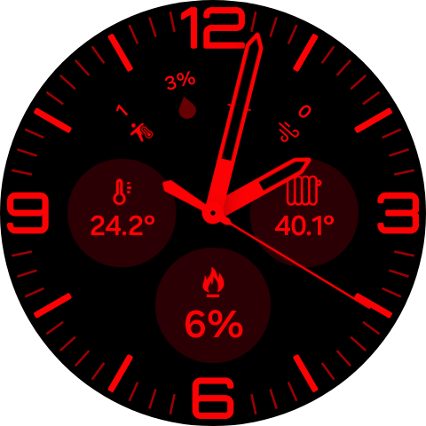
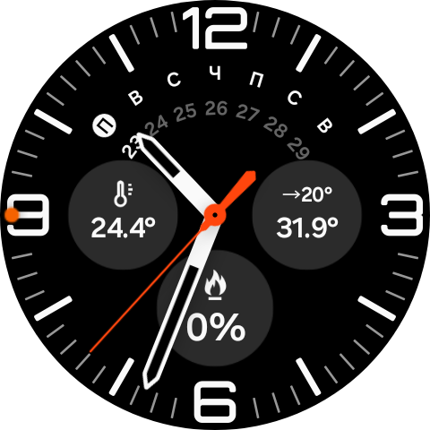
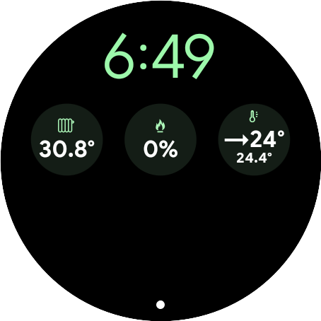

# ZONT Data Handler

`ZONT Data Handler` - это Android / Wear OS приложение для отображения данных из `ZONT Online` на часах Wear OS через complications и отдельный экран обзора на самих часах.

Сценарий работы такой:

- `mobile` авторизуется в `ZONT Online`, получает актуальный snapshot устройства, хранит его локально и отправляет на часы;
- `wear` принимает snapshot, показывает ключевые значения прямо на часах и публикует complication providers для watch face;
- `shared` содержит общую модель данных, форматирование значений и контракт обмена между телефоном и часами.

Проект рассчитан на sideload-установку без Play Market и позволяет быстро вынести на циферблат главные метрики отопления: комнатную температуру, температуру теплоносителя, уставки и модуляцию горелки. Кодовая база целиком сгенерирована Codex. Репозиторий публичный, поэтому логины, пароли, токены и ключи подписи не хранятся в git.

## Screenshots

<p align="center">
  
  
  
</p>

## What It Does

Приложение закрывает простой практический кейс: у владельца котла и датчиков ZONT уже есть данные в облаке `ZONT Online`, но хочется видеть их на запястье без постоянного открытия телефона. Телефон выступает как клиент к API, а часы получают уже подготовленный snapshot и могут отрисовать его в компактном виде на циферблате.

На текущий момент приложение умеет:

- получить `X-ZONT-Token` по логину и паролю или принять уже готовый токен вручную;
- автоматически запросить список устройств и по возможности подставить `device_id`;
- синхронизировать данные по цепочке `phone -> watch`;
- показать на часах overview-экран с несколькими ключевыми метриками;
- показывать установленный version/build на телефоне и на часах для ручной проверки sideload/install path;
- опубликовать набор complication providers для разных типов слотов и watch face.

## Providers

Текущие providers:

- `ZONT overview`
- `ZONT color overview`
- `ZONT room`
- `ZONT burner`
- `ZONT setpoint`
- `ZONT coolant`
- `ZONT setpoint + coolant`
- `ZONT room + air setpoint`

Текущая Wear OS API-ветка проекта не поддерживает честные inline drawable-пиктограммы внутри `ComplicationText`, поэтому `ZONT overview` и paired `LONG_TEXT` providers остаются text-first.

- `ZONT overview` больше не использует noisy leading icon и не навязывает ручной перенос строки: provider отдаёт одну плоскую строку, а конкретный watch face renderer сам решает, где её переложить.
- paired providers сохраняют свои monochromatic pictogram resources там, где renderer их показывает, и явную стрелочку `→` между текущим и целевым значением, чтобы layout оставался понятным даже на face, который скрывает leading icon.

`ZONT color overview` — отдельный emoji-first provider для color-capable renderers. Он не заменяет обычный `ZONT overview`: это осознанный спец-вариант для тех face/slots, где цветные emoji действительно выглядят уместно.

Inline `Material Symbols` для такого текста здесь не подходят: `ComplicationText` не даёт выбрать или встроить нужный font renderer watch face, поэтому имена вроде `whatshot` / `device_thermostat` нельзя надёжно использовать как inline symbols. Для монохромного пути остаются обычные Unicode text glyphs, а `Material Symbols` в проекте реалистично использовать только как наши собственные drawable/vector resources вне inline-текста.

Важно для обновления существующей установки: provider `ZONT overview + icons` удалён из manifest и codebase. Если какой-то slot раньше был привязан именно к нему, после обновления его нужно будет переназначить через системный picker; это не silent fallback, а честное исчезновение удалённого data source.

Для обычных больших слотов, которые открывают стандартный системный picker, сейчас пригодны:

- `ZONT overview`
- `ZONT color overview`
- `ZONT setpoint + coolant`
- `ZONT room + air setpoint`

Эти providers публикуют `LONG_TEXT`, поэтому их можно ставить не только в верхний большой слот, но и в нижний большой слот на watch face, где это разрешено самим циферблатом.

Подтверждённый маппинг реального `z3k-state` устройства сохраняется:

- `roomTemperature` -> комнатная температура
- `burnerModulation` -> модуляция горелки
- `targetTemperature` -> уставка теплоносителя (`setpoint_temp`)
- `coolantTemperature` -> фактическая температура теплоносителя
- `roomSetpointTemperature` -> желаемая температура воздуха в помещении

## Build

Нужно:

- JDK 17
- Android SDK с `platforms;android-36` и `build-tools;36.0.0`

Локальная сборка:

```bash
./gradlew :mobile:assembleDebug :wear:assembleDebug
./gradlew :mobile:assembleRelease :wear:assembleRelease
```

`debug` и `release` здесь не равны по готовности:

- `debug` всегда автоматически подписывается стандартным debug keystore Android Studio / Gradle и подходит только для debug-over-debug install/update пути;
- `release` становится по-настоящему install/update-ready только если вы подписываете его стабильным приватным keystore;
- если release keystore не задан, Gradle честно собирает промежуточный unsigned output, а не "готовый релиз".

Поддерживаемые способы задать release signing:

1. Локальный gitignored `keystore.properties` в корне проекта.
2. Переменные окружения:
   `ZONT_RELEASE_STORE_FILE`, `ZONT_RELEASE_STORE_PASSWORD`, `ZONT_RELEASE_KEY_ALIAS`, `ZONT_RELEASE_KEY_PASSWORD`.

Номер сборки теперь инкрементируется автоматически между сборками:

- по умолчанию `versionCode` берётся из текущего Unix time в секундах, поэтому телефон и часы показывают новый `build` почти при каждом новом `assemble`;
- если нужен явный override, можно задать `ZONT_BUILD_NUMBER`;
- в одном Gradle-запуске `mobile` и `wear` используют один и тот же build number.

Нормальный рабочий сценарий для проекта: использовать один и тот же уже существующий release keystore и те же GitHub Actions secrets для всех следующих release/update APK.

Для первичной локальной подготовки release signing есть готовый скрипт:

```bash
./scripts/generate_release_signing_materials.sh
```

Он нужен только если signing path ещё не настроен. Скрипт создаст:

- gitignored keystore в `.release-local/zont-release.keystore`;
- gitignored локальный `keystore.properties` для Gradle;
- gitignored `.release-local/github-actions-secrets.env` с готовыми значениями для GitHub Actions secrets.

Шаблон для локального файла есть в [keystore.properties.example](keystore.properties.example). Рабочий `keystore.properties` уже игнорируется git, а сам keystore должен храниться вне репозитория и использоваться повторно для всех будущих release update-пакетов. Если release signing уже настроен локально и в GitHub Actions, генерировать новый набор не нужно.

APK после сборки:

- `mobile/build/outputs/apk/debug/mobile-debug.apk`
- `wear/build/outputs/apk/debug/wear-debug.apk`
- `mobile/build/outputs/apk/release/mobile-release.apk` или `mobile-release-unsigned.apk`
- `wear/build/outputs/apk/release/wear-release.apk` или `wear-release-unsigned.apk`

В GitHub Actions есть workflow `build-apks`, который собирает те же debug/release APK, публикует их как artifacts и при push тега создаёт GitHub Release с приложенными APK assets. По умолчанию публичный workflow остаётся без секретов и поэтому публикует unsigned release outputs; если runner получает signing secrets, workflow автоматически восстанавливает keystore, ожидает уже signed `*-release.apk` и отдельно пишет итоговое signed/unsigned состояние в job summary.

Если GitHub Actions secrets уже заведены для вашего стабильного release keystore, переcоздавать их не нужно. Ниже описан только первичный bootstrap для репозитория, где signing path ещё не настраивался.

GitHub secrets нужно заводить так:

1. Откройте `Repository -> Settings -> Secrets and variables -> Actions`.
2. В разделе `Repository secrets` добавьте:
   `ZONT_RELEASE_KEYSTORE_BASE64`
   `ZONT_RELEASE_STORE_PASSWORD`
   `ZONT_RELEASE_KEY_ALIAS`
   `ZONT_RELEASE_KEY_PASSWORD`
3. Источником значений может быть локальный gitignored файл `.release-local/github-actions-secrets.env`, который создаёт `./scripts/generate_release_signing_materials.sh`.
4. Запустите workflow `build-apks` через `Run workflow` или push тега и проверьте в job summary строку `Release signing state: signed`.

## Setup

1. Установите `mobile` на Android emulator или реальный телефон.
2. Установите `wear` на Wear OS emulator или реальные часы.
3. Запустите `wear` один раз, чтобы watch-side приложение создало локальное хранилище и provider'ы появились в системе.
4. На телефоне заполните `device_id`, `zone` и интервал обновления.
5. Получите токен через `Get token` по логину и паролю ZONT или вставьте `X-ZONT-Token` вручную.
6. После `Get token` приложение попытается загрузить `devices[]` и автоматически подставить `device_id`, если это возможно.
7. Нажмите `Refresh` и убедитесь, что snapshot появился на телефоне и дошёл до часов.

Что важно по секретам:

- пароль используется только для запроса `get_authtoken` и не сохраняется;
- токен и остальные настройки сохраняются только локально на телефоне;
- ручной ввод `X-ZONT-Token` остаётся полным fallback-сценарием.

## Manual Check

Базовая регрессия:

1. Проверить, что `Refresh` обновляет snapshot на телефоне без изменения подтверждённого маппинга метрик.
2. Проверить, что данные доходят до `wear` после успешного refresh.
3. Проверить, что телефон и часы показывают ожидаемый установленный version/build.
4. Проверить текущие 8 providers на обычных текстовых слотах.
5. Проверить `ZONT overview`, `ZONT color overview`, `ZONT setpoint + coolant` и `ZONT room + air setpoint` в обычном большом `LONG_TEXT`-слоте, включая нижний большой слот на совместимом watch face; `overview` должен оставаться читаемым и без ручного `\n`, а paired-подача должна оставаться понятной и в варианте с иконкой, и на renderer, который её скрывает.
6. Для `ZONT color overview` отдельно проверить, не делает ли конкретный renderer emoji слишком шумными, цветными или typographically uneven по сравнению с обычным `ZONT overview`.
7. Если slot раньше использовал удалённый `ZONT overview + icons`, убедиться, что после обновления он честно требует повторного выбора provider, а не притворяется рабочим.
8. Проверить placeholder/stale поведение, если refresh сломан или данные старые.
9. Проверить release APK path отдельно:
   debug поверх debug должен обновляться;
   unsigned release не должен называться "готовым install/update path";
   signed release-over-release возможен только при одной и той же приватной подписи.

Реальный путь тестирования:

- Android emulator + Wear OS emulator для быстрой регрессии;
- Galaxy S23+ + Galaxy Watch Ultra для финальной ручной проверки sideload-сценария и сравнения live-render paired/overview с эмулятором.

## Samsung Note

Samsung-specific эксперимент для специальных зон `Galaxy Watch Ultra` / `Ultra Analog` уже проводился и завершился отрицательным результатом.

- специальные части stock Samsung Ultra-циферблатов считаются private-слотами и зарезервированы Samsung/system providers;
- сторонний provider вроде `com.botkin.zontdatahandler` туда штатно встроить нельзя;
- обычные слоты, которые открывают стандартный системный picker, остаются нормальным и поддерживаемым сценарием для наших providers.
